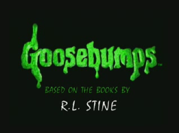
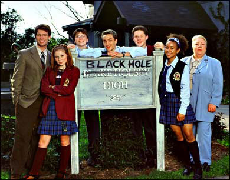
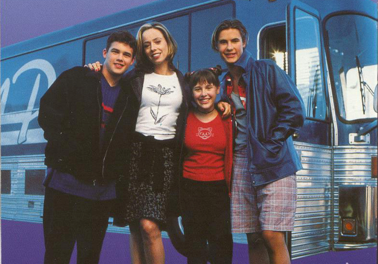
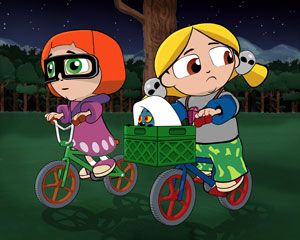
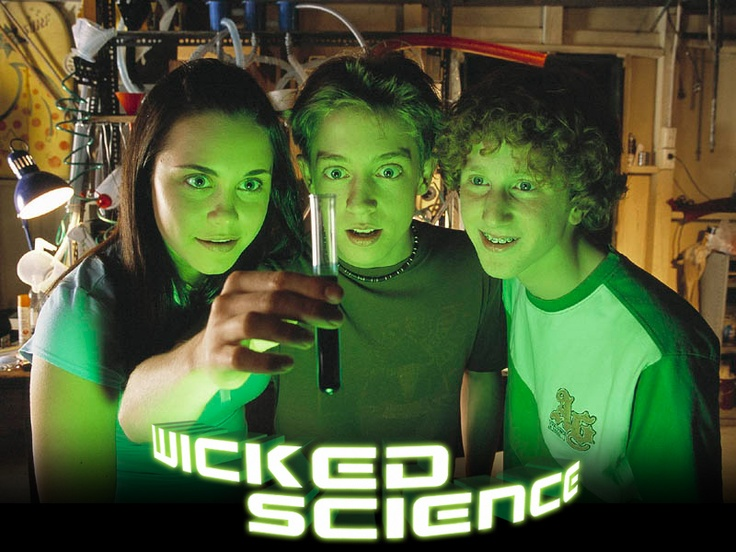
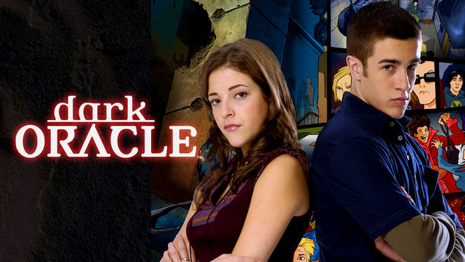

Ese era el nombre del bloque que transmitia programas de terror sobrenatural pasadas las 21hs que tanto temor generaba. **Mysteria**. Hace **AÑOS** vengo buscando el nombre y los programas del mismo, y recien ayer despues de una larga investigacion que consistio en mirar publicidades de entre el 2000 y el 2004 pude encontrarlo. Incluso en un momento llegue a pensar que no existia, o que era producto de un falso recuerdo.

Aun asi, la busqueda empezo hace muchos años atras. Una noche de nostalgia con amigos recorde un capitulo bastante tenebroso de una serie en el cual un espiritu en forma de luz poseia a una persona *(hace unos dias me entere que se trataba del final de la primer temporada)*. No tenia absolutamente ninguna otra informacion, solo eso y el recuerdo que eran las aventuras de una niña que investigaba lo paranormal y vivia en un micro recorriendo la ciudad. Me llevo bastantes horas y dias poder encontrar el programa, ya que en mi mente se llamaba *Las extravagantes historias de Fiona* o *Las extrañas aventuras de Fiona*, y no *Que raro* o *So weird* como es su nombre original. Aun asi, despues de encontrarla, no tenia forma de volver a verla. No existia ningun medio, ni oficial ni ilegal, y las que existian tenian una calidad de video similar a los de OVNIs. 

Para mi suerte, hace meses cuando salio el servicio de Disney+ decidi ver el catalogo a ver si ahora tendria suerte. Y asi fue! Incluso con doblaje latino para disfrutarla en el combo nostalgia total.

Asi que ayer, despues de terminar de ver capitulos de la segunda temporada, decidi buscar ahora con mas informacion el bloque mitico de Fox kids. Recordaba dos o tres series del mismo: *Que raro*, *El colegio del agujero negro* y *Ciencia traviesa*. Despues de navegar youtube por un rato, pude encontrar [este video](https://www.youtube.com/watch?v=8sx75PFyd4w) el cual es justamente la tanda publicitaria. Lo mejor de todo fue la descripcion del mismo, con los nombres de las series no solo en español, si no tambien en su version original. Los cuales son los siguientes:

Escalofrios (Goosebumps): De esta serie si bien es la mas famosa es de la que menos recuerdos poseo.

El colegio del agujero negro (Strange Days at Blake Holsey High): Recuerdo un capitulo que consistia en que dos alumnos cambiaban de cuerpo y tenian que lidear con eso. Tambien de un conserje el cual parecia tenebroso y extraño.

Que raro (So weird): Quien inicio toda esta busqueda. Tal como dije antes recuerdo el capitulo final de la primer temporada y uno de un gran incendio. Pero a ese aun no llegue.

Hermanitas Mysteria (Spooky Sisters): De esta no tengo recuerdo alguno, solo la publicidad cuando la vi, pero nada mas.

Ciencia traviesa (Wicked Science): Aun recuerdo el capitulo que logran clonar un dinosaurio en la casa con un huevo. ¿Que me hablan de homunculos si no vieron esta serie?.

Los misterios del oraculo (Dark Oracle): Absolutamente ningun recuerdo de esta. Es como si no hubiera existido directamente en mi mundo.

Comentarios en el video aseguran que tambien habia un septimo programa llamado *Historias de Miedo (True Real Scary Stories/ Scary but True)* pero de esa tampoco tengo memoria alguna.
